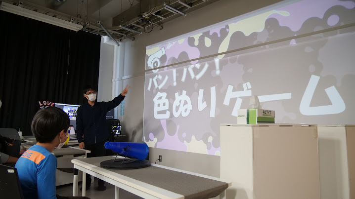
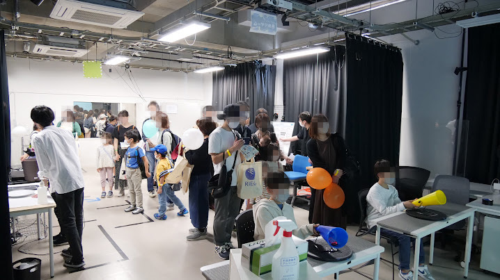
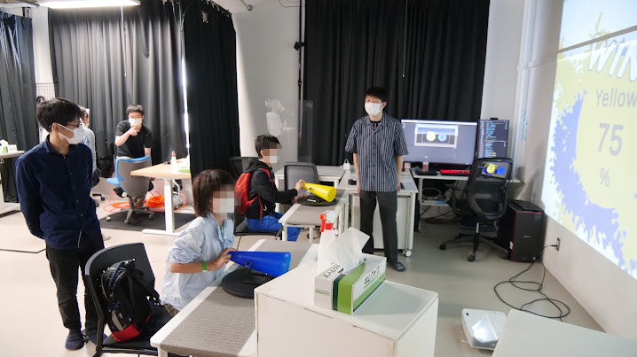
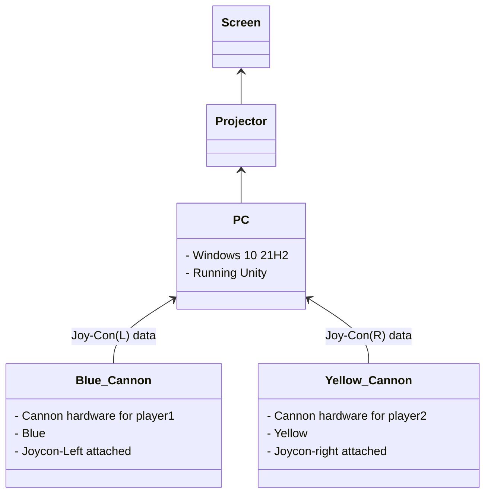
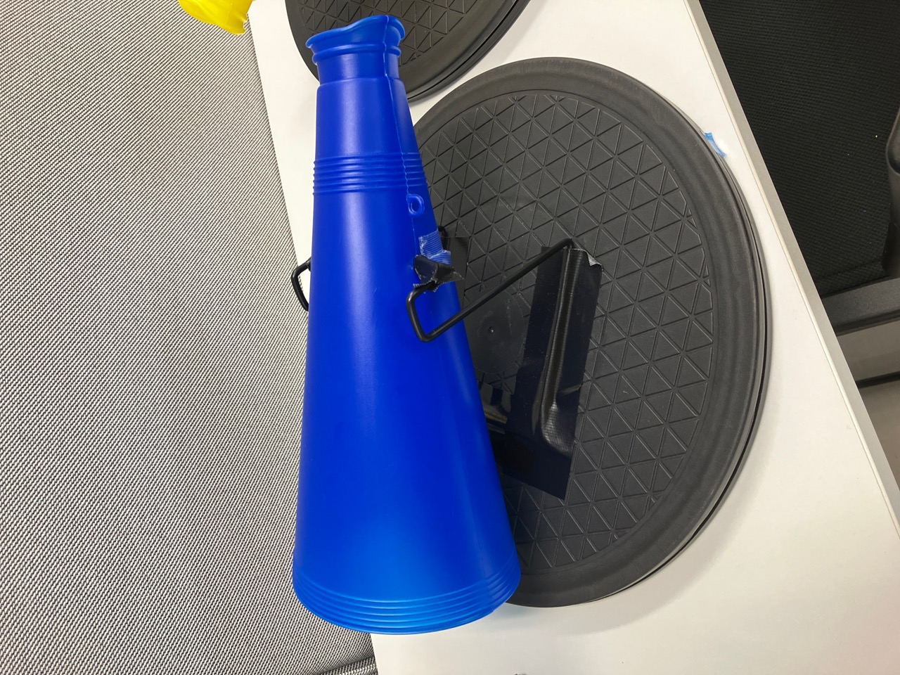
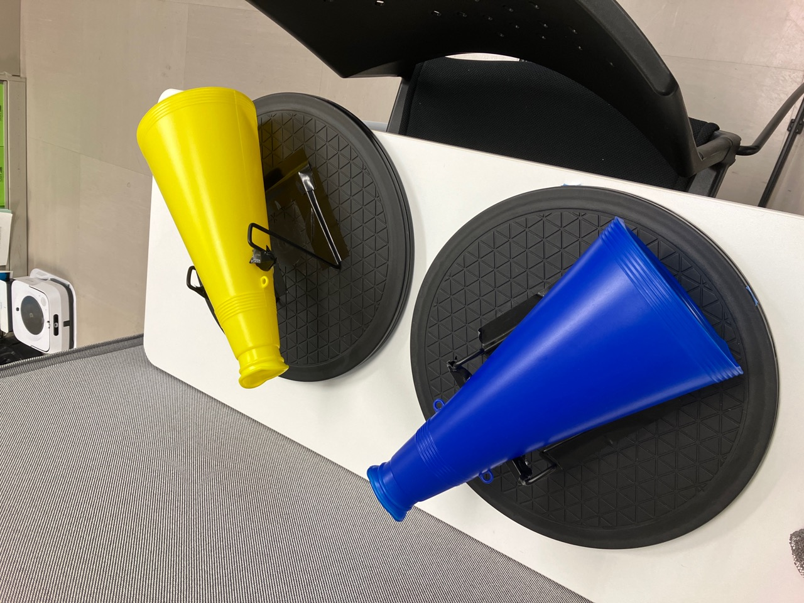
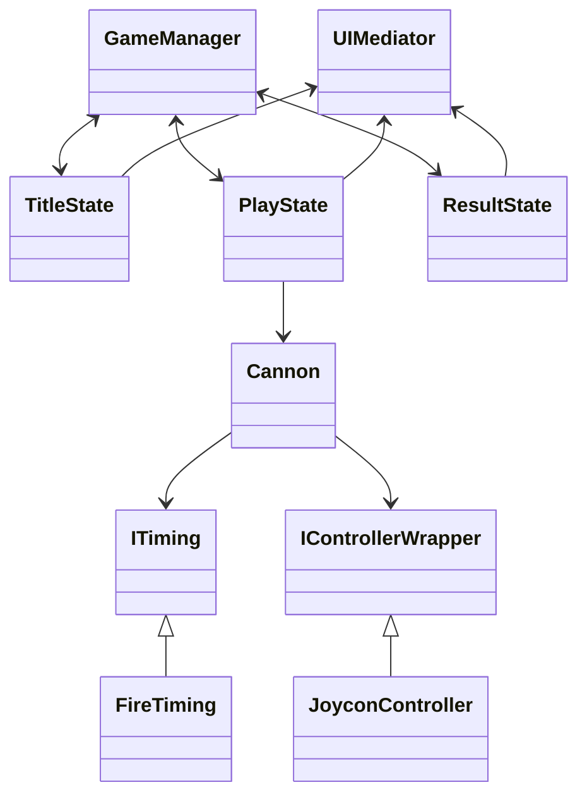

# プロジェクション色塗りゲーム for OpenRIEC2022

**開発コードネーム：ColorWars**

[通研公開(2022)](https://www.riec.tohoku.ac.jp/koukai/)で展示した色塗りゲームに関する紹介ページです。
**本リポジトリにあるソースコードのみではゲームが動作しません。**  
有料アセットを使用しているため、公開できない部分のコードはすべて削除しています。
私たちが作成したコードは`Assets/Scripts`内にすべてありますので、よろしければそちらをご覧ください。

## 制作メンバー紹介

- 板倉 晃平（企画・ハードウェア作成・アセット作成）
- 田中 雄大（企画・ハードウェア作成・アセット作成）
- 米澤 晴（企画・ハードウェア作成・アセット作成）
- 五味 遼太（企画・ソフトウェア開発）
- 村上 大知（企画・ソフトウェア開発・全体責任者）

#### Special Thanks

- 北村高島研究室の皆さんと先生方
- 会場で遊んでくださった方々

---

## ゲームの概要

手元に用意された、上下左右に回転可能な砲台を動かして、狙った場所にインク弾を飛ばしてもらうゲームです。  
インク弾が目の前の壁に着弾すると壁を塗ることができ、最終的に塗った面積が大きい方が勝ちです。

## 遊んでいる様子

### 通研公開当日の様子

### プレイ映像

**[\_Movies/gameplay-captured.mp4](https://drive.google.com/file/d/1OMph0C8mAZ_f7HxLF-YRZH0FDfAIg9nj/view?usp=sharing) をご覧ください**

（閲覧できない場合、お手数ですが本リポジトリの`_Movies/gameplay-captured.mp4`をご覧ください）

### プレイ映像２

**[\_Movies/gameplay-atomosphere.mp4](https://drive.google.com/file/d/1sSACc0lE-DgCkgRukuteq66iMgZi470Y/view?usp=sharing) をご覧ください**

（閲覧できない場合、お手数ですが本リポジトリの`_Movies/gameplay-atmosphere.mp4`をご覧ください）

---

## 詳細説明

### 全体構成

---

### ハードウェアについて

砲台部分のハードウェアは、ダイソーで購入した３つのパーツ（メガホン、スタンド、回転テーブル）をテープで固定することで作成しています。

実際に稼働している様子は[こちらの動画](https://drive.google.com/file/d/127ZbuFSEB8e7z8iN8jQ2JzwtOaCqSfJm/view?usp=sharing)を参考にしてください。  
（閲覧できない場合、お手数ですが本リポジトリの`_Movies/hardware.MOV`をご覧ください）

  
  

メガホン内部に Joy-Con をテープで固定し、JoyconLib というライブラリを用いて Joy-Con のセンサーデータを Unity から取得します。

#### Joycon を用いた砲台操作の仕組みについて

Joycon に搭載されている加速度センサとジャイロセンサの値を用いて、Joycon 本体の姿勢推定を行なうことで、Joycon の角度とゲーム画面内の砲台の角度を一致させています。

---

### ソフトウェアについて

#### 開発環境

- OS: Windows 10 21H2
- Unity Editor Version: 3.10f1
- IDE: VS Code または JetBrain (任意選択)
- バージョン管理・共有: git + github

#### コード設計

ゲーム本体は`Assets/Scripts`内に記述されています。
簡単なクラス設計は以下の通りです。

#### 利用した外部ライブラリやアセット等

- **PainZ** ... スプラトゥーン風のインクのテクスチャを簡単に生成することができる便利な有料アセット。点数計算なども API を通して提供してくれています。実装コストが大幅に削減されたため、大変助かりました。
- **JoyconLib** ... Bluetooth で PC と接続された Joy-Con のセンサやボタン等のデータをリアルタイムで取得することができるライブラリです。Unity 上で動作するため別途サーバーを立てる必要がなく、かつ応答が高速であるため実用性が高いです。
